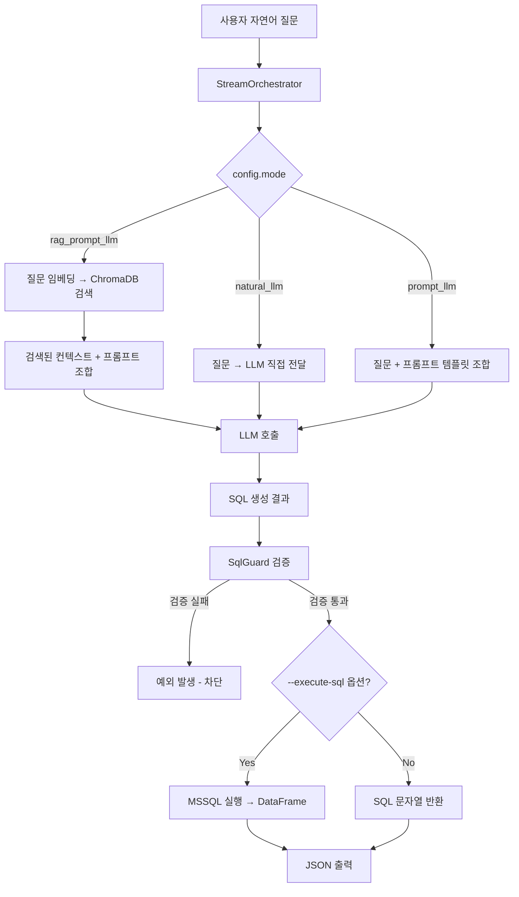
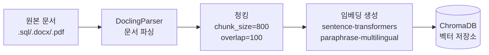

# DB_to_LLM

> 자연어(한국어) 질문을 MSSQL SELECT 쿼리로 자동 변환하는 Text-to-SQL 파이프라인

---

## 프로젝트 소개

**DB_to_LLM**은 사용자가 자연어로 데이터베이스에 질문하면, LLM(대형 언어 모델)이 실행 가능한 MSSQL SELECT 쿼리를 자동으로 생성하고 선택적으로 DB에 직접 실행해 결과를 반환하는 시스템입니다.

- **기본 LLM 엔진**: [Ollama](https://ollama.com) (로컬 실행)
- **확장 가능 LLM**: OpenAI API (config 전환만으로 교체 가능)
- **RAG 기반 쿼리 생성**: ChromaDB + 임베딩 검색으로 스키마/업무 규칙 문서를 참조한 정확도 높은 쿼리 생성
- **REST API 서버**: FastAPI로 동일한 로직을 HTTP 엔드포인트로 노출
- **안전 실행 보장**: 생성된 SQL은 SqlGuard로 검증 후 실행 → 데이터 변경 구문 차단

---

## 왜 이 프로젝트를 만들었는가

제조·산업 현장의 데이터베이스는 수십~수백 개의 복잡한 테이블로 구성됩니다.
비개발 직군이 데이터를 조회하려면 SQL 작성 능력이 필요하거나, 개발팀에 요청해야 했습니다.

이 프로젝트는 다음 문제를 해결합니다:

- **"테이블 구조를 모르더라도 한국어로 질문하면 SQL 쿼리를 자동으로 생성"**
- RAG를 이용해 설비 로그 테이블 설명, 컬럼 의미, 업무 규칙 문서를 검색·참조
- LLM 단독 / 프롬프트 기반 / RAG 기반 방식을 모두 실험·비교할 수 있는 구조 제공

---

## 핵심 기능

| 기능 | 설명 |
|------|------|
| `natural_llm` 모드 | 질문을 그대로 LLM에 전달해 SQL 생성 |
| `prompt_llm` 모드 | 구조화된 프롬프트 템플릿과 결합해 SQL 생성 |
| `rag_prompt_llm` 모드 | 임베딩 문서 검색(RAG) + 프롬프트 + LLM으로 SQL 생성 |
| SQL 안전 검증 | 금지 키워드 차단 (DELETE/DROP/UPDATE 등) |
| MSSQL 직접 실행 | 생성된 SQL을 MSSQL에 실행, DataFrame 반환 |
| FastAPI 서버 | HTTP POST로 쿼리 생성 요청 가능 |
| 문서 인제스트 | 문서 파싱 → 청킹 → 임베딩 → ChromaDB 적재 |
| CLI 실행 | `python -m Root_Stream.main` 으로 직접 실행 |
| Notebook 실험 | 단계별 Jupyter Notebook 제공 |

---

## 시스템 아키텍처

```
┌─────────────────────────────────────────────────────────┐
│                    DB_to_LLM                            │
│                                                         │
│  ┌──────────────────┐     ┌──────────────────────────┐  │
│  │   Root_Ingest    │────▶│      ChromaDB            │  │
│  │  (문서 → 벡터)   │     │  (임베딩 벡터 저장소)     │  │
│  └──────────────────┘     └────────────┬─────────────┘  │
│                                        │ 검색(RAG)       │
│  ┌─────────────────────────────────────▼──────────────┐ │
│  │                  Root_Stream                        │ │
│  │                                                     │ │
│  │  사용자 질문                                         │ │
│  │      │                                              │ │
│  │      ▼                                              │ │
│  │  StreamOrchestrator                                 │ │
│  │  (config.mode 기반 분기)                             │ │
│  │      │                                              │ │
│  │  ┌───┴──────────────────────────┐                  │ │
│  │  │  natural_llm                 │                  │ │
│  │  │  prompt_llm                  │ ──▶ LLM 호출     │ │
│  │  │  rag_prompt_llm              │     (Ollama/     │ │
│  │  └──────────────────────────────┘      OpenAI)     │ │
│  │                                                     │ │
│  │  생성된 SQL                                          │ │
│  │      │                                              │ │
│  │      ▼                                              │ │
│  │  SqlGuard (안전 검증)                                │ │
│  │      │                                              │ │
│  │      ▼                                              │ │
│  │  MSSQL 실행 (선택적)                                 │ │
│  └─────────────────────────────────────────────────────┘ │
└─────────────────────────────────────────────────────────┘
```

---

## 전체 워크플로우



---

## RAG 파이프라인 설명

### 1단계: 문서 인제스트 (Root_Ingest)

DB 스키마 설명 문서(`.sql`, `.docx`, `.pdf`, `.md` 등)를 벡터 저장소에 적재합니다.



**파서 선택**: `Root_Ingest/config/config.yaml`의 `parsing.parser` 값으로 `docling`, `marker`, `unstructured` 중 선택합니다.

### 2단계: RAG 검색 (Root_Stream – rag_prompt_llm 모드)

1. 사용자 질문을 동일한 임베딩 모델로 벡터화
2. ChromaDB에서 cosine 유사도 기준 상위 `top_k`(기본: 3)개 청크 검색
3. 검색된 텍스트(스키마 설명, 업무 규칙 등)를 `rag_query_generation_prompt` 템플릿의 `{retrieved_context}` 변수에 삽입
4. LLM에 최종 프롬프트 전달 → SQL 생성

> **검색 근거 확인**: `StreamResult.retrieved_contexts` 필드에 각 검색 청크의 `chunk_id`, `text`, `score`가 기록되어 어떤 문서를 참조했는지 추적 가능합니다.

---

## 디렉토리 구조

```
DB_to_LLM/
├── README.md                        ← 이 파일
├── requirements.txt                 ← 전체 의존성
├── Rule.md                          ← 개발 규칙 (코드 작성 원칙)
├── .gitignore
├── .env.example                     ← 환경변수 예시
├── .vscode/
│   └── launch.json                  ← VSCode 디버그 설정 3종
├── docs/                            ← 아키텍처 문서 등
├── Api_test/
│   └── api_test_client.py           ← HTTP 테스트 클라이언트
│
├── Root_Ingest/                     ← 문서 → 벡터 DB 파이프라인
│   ├── config/
│   │   └── config.yaml              ← 파서, 청킹, 임베딩, 경로 설정
│   ├── doc/                         ← 인제스트 대상 원본 문서
│   ├── data/
│   │   ├── chroma/                  ← ChromaDB 벡터 저장소 (로컬)
│   │   ├── chunks/chunks.jsonl      ← 청킹 결과 캐시
│   │   ├── embeddings/embeddings.jsonl ← 임베딩 결과 캐시
│   │   └── parsed/                  ← 파싱 결과 캐시
│   ├── ingest/
│   │   ├── ingest_pipeline.py       ← 전체 파이프라인 실행 (문서→벡터)
│   │   ├── document_loader.py       ← 폴더에서 문서 수집
│   │   ├── parser_service.py        ← 파서 실행 및 결과 저장
│   │   ├── chunk_service.py         ← 텍스트 청킹
│   │   ├── embedding_service.py     ← sentence-transformers 임베딩
│   │   ├── vector_store_service.py  ← ChromaDB upsert
│   │   └── parsers/
│   │       ├── factory.py           ← 파서 선택 팩토리
│   │       ├── docling_parser.py    ← Docling 기반 파서 (기본)
│   │       ├── marker_parser.py     ← Marker 기반 파서
│   │       └── unstructured_parser.py ← Unstructured 기반 파서
│   ├── notebooks/                   ← 인제스트 단계별 실험 노트북
│   │   ├── 01_document_load.ipynb
│   │   ├── 02_parse.ipynb
│   │   ├── 03_chunk.ipynb
│   │   ├── 04_embed.ipynb
│   │   ├── 05_vector_store.ipynb
│   │   └── 06_end_to_end_test.ipynb
│   └── utils/                       ← 공통 유틸리티
│
└── Root_Stream/                     ← 자연어 → SQL 생성 파이프라인
    ├── config/
    │   ├── config.yaml              ← 실제 설정 (gitignore, 로컬 전용)
    │   └── config.example.yaml      ← 설정 항목 예시 (민감값 제거)
    ├── main.py                      ← CLI 진입점
    ├── orchestrator/
    │   └── stream_orchestrator.py   ← mode 분기 및 실행 조율
    ├── prompts/
    │   ├── prompt_manager.py        ← 프롬프트 키 조회/렌더링
    │   └── prompt_templates.yaml    ← 모든 프롬프트 중앙 관리
    ├── services/
    │   ├── llm/
    │   │   ├── llm_factory.py       ← provider 선택 팩토리
    │   │   ├── ollama_client.py     ← Ollama HTTP 클라이언트
    │   │   └── openai_client.py     ← OpenAI API 클라이언트
    │   ├── retrieval/
    │   │   ├── chroma_retriever.py  ← ChromaDB 유사도 검색
    │   │   └── embedding_service.py ← 질문 임베딩 (sentence-transformers)
    │   ├── sql/
    │   │   ├── sql_guard.py         ← SQL 안전 검증 (SELECT만 허용)
    │   │   ├── mssql_client.py      ← MSSQL 연결 및 DataFrame 반환
    │   │   ├── sql_executor_service.py  ← guard → DB 실행 통합
    │   │   ├── sql_execution_hook.py    ← CLI 실행 훅
    │   │   ├── sql_execution_integration.py ← 생성 결과 연결 헬퍼
    │   │   └── sql_execution_output.py  ← 출력 포맷터
    │   ├── stream/
    │   │   ├── mode_natural_llm.py  ← natural_llm 모드 실행 로직
    │   │   ├── mode_prompt_llm.py   ← prompt_llm 모드 실행 로직
    │   │   └── mode_rag_prompt_llm.py ← rag_prompt_llm 모드 실행 로직
    │   └── query_service.py         ← API 서버용 쿼리 생성 서비스
    ├── server/
    │   ├── api_app.py               ← FastAPI 앱 (진입점)
    │   ├── routes.py                ← POST /api/query/generate 라우트
    │   ├── models.py                ← API 요청/응답 Pydantic 모델
    │   └── debug_client.py          ← 서버 로컬 테스트 클라이언트
    ├── stream/
    │   └── models.py                ← StreamRequest / StreamResult 데이터 모델
    ├── notebooks/                   ← 모드별 실험 노트북
    │   ├── 01_natural_llm.ipynb
    │   ├── 02_prompt_llm.ipynb
    │   └── 03_rag_prompt_llm.ipynb
    └── utils/                       ← 공통 유틸리티
        ├── config_loader.py
        ├── logger.py
        └── path_utils.py
```

---

## 설정 파일 설명

### Root_Stream/config/config.yaml (실제 사용, gitignore 적용)

`Root_Stream/config/config.example.yaml`을 복사한 뒤 실제 값을 채워 사용합니다.

```yaml
# 실행 모드: natural_llm | prompt_llm | rag_prompt_llm
mode: rag_prompt_llm

# LLM provider: ollama | openai
llm_provider: ollama

ollama:
  model: qwen2.5:14b          # Ollama에서 실행 중인 모델명
  base_url: http://<HOST>:11434/
  request_timeout: 60

openai:
  model: gpt-4.1-mini
  api_key: ""                 # 환경변수 OPENAI_API_KEY 권장

retrieval:
  enabled: true               # false 이면 rag_prompt_llm 모드 사용 불가
  embedding_model: sentence-transformers/paraphrase-multilingual-MiniLM-L12-v2
  chroma_path: ../Root_Ingest/data/chroma
  collection_name: doc_chunks
  top_k: 3                    # 검색 참조 청크 수

prompts:
  active_prompt: query_generation_prompt

database:
  type: mssql
  host: <DB_HOST>
  port: 1433
  database: <DB_NAME>
  username: <DB_USER>
  password: <DB_PASSWORD>
  driver: "ODBC Driver 17 for SQL Server"
  encrypt: false
  trust_server_certificate: true
  timeout: 30

sql:
  allow_only_select: true     # true 이면 SELECT/WITH 외 구문 차단
  max_rows: 1000              # 조회 최대 행 수 제한
```

### Root_Ingest/config/config.yaml

| 항목 | 기본값 | 설명 |
|------|--------|------|
| `parsing.parser` | `docling` | 파서 종류 (`docling` / `marker` / `unstructured`) |
| `chunking.chunk_size` | `800` | 청크 최대 글자 수 |
| `chunking.chunk_overlap` | `100` | 청크 간 겹침 구간 |
| `embedding.model_name` | `paraphrase-multilingual-MiniLM-L12-v2` | 임베딩 모델 |
| `vector_store.collection_name` | `doc_chunks` | ChromaDB 컬렉션명 |

---

## 프롬프트 구조 설명

모든 프롬프트는 `Root_Stream/prompts/prompt_templates.yaml`에서 **중앙 관리**됩니다.  
`PromptManager`가 키 기반으로 조회하고, `{변수명}` 형식의 플레이스홀더를 실행 값으로 렌더링합니다.

| 프롬프트 키 | 사용 모드 | 설명 |
|------------|-----------|------|
| `default_system_prompt` | `natural_llm` | 시스템 역할 정의. 질문만 그대로 전달 |
| `query_generation_prompt` | `prompt_llm` | `{question}`, `{schema_context}`, `{business_rules}`, `{additional_constraints}` 변수 포함 |
| `rag_query_generation_prompt` | `rag_prompt_llm` | 위 변수 + `{retrieved_context}` (RAG 검색 결과) 추가 |

**공통 원칙**: 모든 프롬프트는
- MSSQL 문법만 사용하도록 지시
- SELECT 쿼리만 생성 (변경 구문 금지)
- 출력은 SQL 본문만 반환 (설명, 코드블록 금지)

---

## 실행 방법

### 1. 환경 구성

```bash
# 가상환경 생성 및 활성화
python -m venv .venv

# Windows
.venv\Scripts\activate

# macOS/Linux
source .venv/bin/activate
```

```bash
# 패키지 설치
pip install -r requirements.txt
```

### 2. Ollama 준비 (로컬 LLM 사용 시)

```bash
# Ollama 설치 후 모델 다운로드 (예시)
ollama pull qwen2.5:14b
ollama serve  # 기본 포트 11434
```

> OpenAI를 사용하려면 `config.yaml`에서 `llm_provider: openai`로 변경하고  
> `api_key`를 환경변수 `OPENAI_API_KEY`에 설정하세요.

### 3. 설정 파일 준비

```bash
# 예시 설정을 복사한 뒤 실제 값을 채웁니다
cp Root_Stream/config/config.example.yaml Root_Stream/config/config.yaml
# config.yaml 을 열어 host, port, database, username, password 입력
```

### 4. 문서 인제스트 (RAG 사용 시)

```bash
# Root_Ingest/doc/ 폴더에 .sql / .docx / .pdf 등 스키마 문서를 넣고 실행
python -m Root_Ingest.ingest.ingest_pipeline
# 또는 Root_Ingest/notebooks/ 에서 단계별로 실행
```

### 5. CLI 실행

**SQL 생성만 (DB 실행 없음)**
```bash
python -m Root_Stream.main --question "최근 경고 로그 100건을 조회해줘"
```

**SQL 생성 + MSSQL 직접 실행**
```bash
python -m Root_Stream.main --execute-sql --question "최근 30일 동안 각 설비별 오류 건수를 보여줘"
```

**설정 파일 직접 지정**
```bash
python -m Root_Stream.main --config /path/to/config.yaml --question "장비별 평균 가동 시간을 알려줘"
```

### 6. FastAPI 서버 실행

```bash
uvicorn Root_Stream.server.api_app:app --host 127.0.0.1 --port 8000 --reload
```

서버 실행 후 API 요청:
```bash
curl -X POST http://127.0.0.1:8000/api/query/generate \
  -H "Content-Type: application/json" \
  -d '{"question": "최근 오류 로그 50건 조회", "mode": "rag_prompt_llm"}'
```

헬스체크:
```bash
curl http://127.0.0.1:8000/health
# {"status": "ok"}
```

---

## 테스트 및 디버그 방법

### VSCode 디버그 실행 (권장)

`.vscode/launch.json`에 3가지 디버그 구성이 포함되어 있습니다.

| 구성 이름 | 설명 |
|-----------|------|
| `Debug STREAM` | CLI 모드로 SQL 생성 + MSSQL 실행 |
| `Debug STREAM Server` | FastAPI 서버를 포트 8000으로 시작 |
| `Debug STREAM Server Client` | `debug_client.py`로 서버에 테스트 요청 전송 |

VS Code에서 `F5`를 누르거나 실행 및 디버그 패널에서 원하는 구성을 선택합니다.

### Jupyter Notebook 단계별 테스트

**인제스트 단계** (`Root_Ingest/notebooks/`)

| 노트북 | 역할 |
|--------|------|
| `01_document_load.ipynb` | 문서 수집 확인 |
| `02_parse.ipynb` | 파싱 결과 확인 |
| `03_chunk.ipynb` | 청킹 결과 확인 |
| `04_embed.ipynb` | 임베딩 벡터 확인 |
| `05_vector_store.ipynb` | ChromaDB 적재 확인 |
| `06_end_to_end_test.ipynb` | 전체 파이프라인 E2E 테스트 |

**쿼리 생성 단계** (`Root_Stream/notebooks/`)

| 노트북 | 역할 |
|--------|------|
| `01_natural_llm.ipynb` | `natural_llm` 모드 실험 + MSSQL 실행 |
| `02_prompt_llm.ipynb` | `prompt_llm` 모드 실험 |
| `03_rag_prompt_llm.ipynb` | `rag_prompt_llm` 모드 실험 |

### API 테스트 클라이언트

`Api_test/api_test_client.py`를 사용하면 서버에 HTTP 요청을 보내 테스트할 수 있습니다.

```bash
python Api_test/api_test_client.py --question "오류 건수가 많은 설비 Top 10 조회"
```

---

## 예시 입력/출력

**입력**
```
질문: "최근 30일 동안 각 설비별 첫 오류 발생 시각과 마지막 오류 발생 시각, 총 오류 건수를 보여줘"
mode: rag_prompt_llm
```

**출력 (JSON)**
```json
{
  "mode": "rag_prompt_llm",
  "question": "최근 30일 동안 각 설비별 첫 오류 발생 시각과 ...",
  "query": "SELECT EquipmentID, MIN(ErrorTime) AS FirstErrorTime, MAX(ErrorTime) AS LastErrorTime, COUNT(*) AS TotalErrors FROM ErrorLog WHERE ErrorTime >= DATEADD(DAY, -30, GETDATE()) GROUP BY EquipmentID ORDER BY TotalErrors DESC",
  "llm_provider": "ollama",
  "prompt_key": "rag_query_generation_prompt",
  "retrieved_contexts": [
    {
      "chunk_id": "...",
      "text": "ErrorLog 테이블: 설비별 오류 이벤트를 기록...",
      "score": 0.92
    }
  ]
}
```

---

## 현재 구현 상태와 로드맵

### 현재 구현됨 ✅

- [x] `natural_llm` / `prompt_llm` / `rag_prompt_llm` 모드 실행
- [x] Ollama + OpenAI provider 전환
- [x] ChromaDB 기반 RAG 검색
- [x] SqlGuard (SELECT/WITH 허용, 금지 키워드 차단)
- [x] MSSQL 연결 및 DataFrame 조회
- [x] FastAPI 서버 (`POST /api/query/generate`)
- [x] 통일된 `StreamResult` 반환 구조 (모드 비교 가능)
- [x] 문서 인제스트 파이프라인 (Docling/Marker/Unstructured 선택 가능)
- [x] 각 단계별 Jupyter Notebook
- [x] VSCode 디버그 설정 3종

### 확장 예정 / 확장 가능 🛣️

| 항목 | 설명 |
|------|------|
| 쿼리 라우터 | 질문을 `DB/RAG/GENERAL` 유형으로 자동 분류 후 모드 자동 선택 |
| 스트리밍 응답 | LLM 토큰 단위 스트리밍 (`StreamingResponse`) |
| 검증기/가드레일 강화 | SQL 문법 오류 자동 재시도, 컬럼명 존재 여부 검증 |
| MySQL / PostgreSQL 지원 | `mssql_client` 외 다른 DB 클라이언트 추가 |
| `api_result` 모드 | 외부 API 응답을 기반으로 SQL 생성 (구조 예비됨, 미구현) |
| 웹 UI | 간단한 채팅 인터페이스 연결 |
| 캐싱 | 동일 질문 결과 캐싱으로 LLM 호출 비용 절감 |

---

## 주의사항 및 한계

### SQL 안전성
- `SqlGuard`는 키워드 기반 차단으로, 우회 가능성이 완전히 없지는 않습니다.
- 운영 DB 연결 시 **읽기 전용 DB 계정** 사용을 강력히 권장합니다.
- `sql.allow_only_select: true` 설정을 반드시 유지하세요.

### LLM 기반 쿼리 생성 한계
- LLM은 실제로 존재하지 않는 컬럼/테이블명을 만들어낼 수 있습니다.
- RAG 모드를 사용해 정확한 스키마 문서를 충분히 인제스트할수록 정확도가 높아집니다.
- 생성된 SQL을 운영 환경에 바로 실행하기 전에 반드시 검토하세요.

### 환경 설정
- `config.yaml`은 DB 접속 정보를 포함하므로 **반드시 gitignore** 처리합니다.
- MSSQL 실행을 위해서는 로컬에 `ODBC Driver 17 for SQL Server`가 설치되어 있어야 합니다.
- Ollama 사용 시 모델 다운로드 및 서버 실행이 선행되어야 합니다.

### 미구현 / 주의 필요
- `api_result` 모드 (외부 API 기반 쿼리 생성): 구조는 예비되어 있으나 현재 미구현
- 다중 SQL 문장은 SqlGuard에서 차단 (단일 SELECT만 허용)
- MSSQL 외 DB(MySQL, PostgreSQL)는 현재 직접 지원하지 않음

---

## 결론

DB_to_LLM은 자연어 질문을 MSSQL 쿼리로 변환하는 실험적이면서도 실제 운영 환경에 단계적으로 적용 가능한 Text-to-SQL 파이프라인입니다.

LLM 단독 방식부터 RAG 기반 방식까지 동일한 인터페이스로 비교·실험할 수 있으며,
SQL 안전 검증, DB 직접 실행, FastAPI 서버 연동까지 하나의 프로젝트에서 제공합니다.

스키마 문서를 잘 정리해 인제스트하고, 프롬프트를 목적에 맞게 조정하면 실무 수준의 쿼리 생성 정확도를 기대할 수 있습니다.
